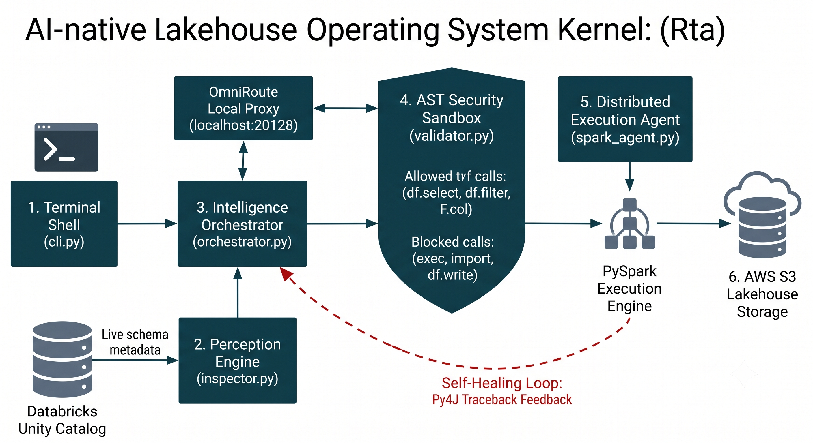
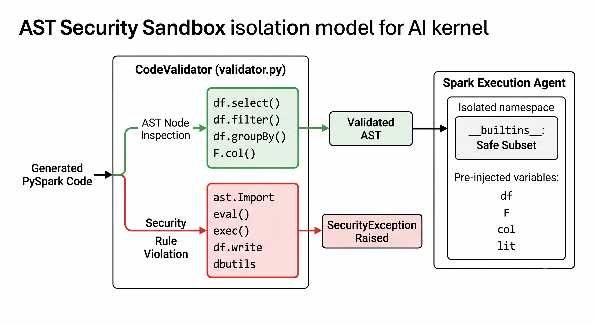

# RTA OS — Runtime Intelligence & Trust Architecture

> A professional AI-native operating system for safe, observable, and self-improving data workflows across cloud lakehouses and enterprise runtime systems.

This repository is the control plane for an autonomous runtime that orchestrates memory, execution, validation, observation, and self-evaluation while preserving secure operational boundaries.

- Project brief: [docs/project/project_plan.md](docs/project/project_plan.md)
- Branch policy: [docs/project/branch_policy.md](docs/project/branch_policy.md)

[](https://www.python.org/)
[](https://spark.apache.org/)
[](https://opensource.org/licenses/MIT)

---

## 🏛️ Architecture Overview

Unlike conventional operating systems that map file systems and CPU threads to local disk and hardware, Rta functions as an autonomous kernel mapping its runtime directly to cloud storage (AWS S3) and distributed lakehouse metastores (Databricks / Unity Catalog).

```text
                  [ User Natural Language Input ]
                                │
                                ▼
                     1. Terminal Shell (cli.py)
                                │
                                ▼
                 2. Perception Engine (inspector.py) ◄── [ Unity Catalog Metadata ]
                                │
                                ▼
               3. Intelligence Orchestrator (orchestrator.py) ◄── [ OmniRoute Proxy ]
                                │
                                ▼
                4. AST Security Sandbox (validator.py)
                                │
                                ▼
              5. Execution Agent (spark_agent.py) ──► [ PySpark Cluster ]
                                │                         │
                                ▼                         ▼
                     [ S3 Lakehouse Storage ]   6. Self-Healing Loop
                                                 (Traceback Repair)
```

---

## 🔑 Core Features

- 💻 Interactive Kernel Shell (cli.py): accepts natural language instructions to formulate and execute PySpark transformations.
- 🔍 Live Schema Perception (inspector.py): queries Databricks Unity Catalog to ground AI code generation in real-time schema metadata.
- 🤖 Intelligence Orchestrator (orchestrator.py): constructs context-rich prompts routed via proxy gateways (OmniRoute at http://localhost:20128/v1).
- 🛡️ AST Security Sandbox (validator.py): parses generated Python AST to block dangerous system, execution, or persistent write calls (eval, exec, import, df.write, dbutils) before code execution.
- ⚡ Distributed Execution Agent (spark_agent.py): submits validated transformations against an active Spark session.
- 🔁 Self-Healing Loop: intercepts runtime AnalysisException and Py4J tracebacks, feeding structured error logs back to the orchestrator for real-time automated code repairs.

---

## 🧭 Architecture Diagrams

### System architecture and execution lifecycle



### Security sandbox isolation model



### Task graph and execution roadmap

See the dependency roadmap in [docs/roadmap/task_graph.md](docs/roadmap/task_graph.md) for the phased build plan covering runtime control plane, memory, sandboxing, autonomous operations, and economic rails.

---

## 📂 Repository Structure

```text
rta/

├── infra/
│   └── terraform/             # S3 bucket & Databricks cluster IaC
├── src/
│   └── datakernel_os/
│       ├── agents/
│       │   └── spark_agent.py # PySpark execution agent & self-healing retry loop
│       ├── core/
│       │   ├── inspector.py   # Unity Catalog schema perception engine
│       │   ├── kernel.py      # S3 and Databricks connectivity abstraction
│       │   ├── orchestrator.py# LLM code translation & feedback repair orchestrator
│       │   └── validator.py   # AST security sandbox validator
│       └── cli.py             # Interactive Rta terminal shell
├── tests/                     # Test suite
├── .env.example               # Environment template
├── requirements.txt           # Python dependencies
└── README.md
```

---

## 🚀 Quickstart

### 1. Prerequisites

- Python 3.10+
- Apache Spark / PySpark environment
- AWS credentials (S3 access) and a Databricks workspace token

### 2. Environment Setup

```bash
# Clone repository
git clone https://github.com/SayandB/rta.git
cd rta

# Set up virtual environment
python3 -m venv venv
source venv/bin/activate

# Install dependencies
pip install -r requirements.txt

# Configure environment variables
cp .env.example .env
```

Edit `.env` with your cloud credentials:

```text
AWS_REGION=us-east-1
S3_BUCKET=your-lakehouse-bucket
DATABRICKS_HOST=https://your-workspace.cloud.databricks.com
DATABRICKS_TOKEN=your-access-token
```

### 3. Launch the Rta Shell

```bash
python src/datakernel_os/cli.py
```

---

## 🛡️ AST Sandbox Security Rules

The AST validator enforces a strict read-bounded execution sandbox:

| Category | Permitted | Blocked |
| --- | --- | --- |
| Transformations | df.select, df.filter, df.groupBy, df.withColumn, F.col, F.lit | df.write, df.writeStream, saveAsTable |
| System Calls | None | eval(), exec(), open(), compile() |
| Imports | Pre-injected pyspark.sql.functions | import os, import sys, ast.Import |
| Platform Tools | None | dbutils, subprocess |

---

## 🤝 Contributing

Contributions are welcome. Please feel free to open an issue or submit a pull request for new kernel features, AST sandbox rules, or orchestrator improvements.

---

## 📄 License

This project is licensed under the MIT License.
