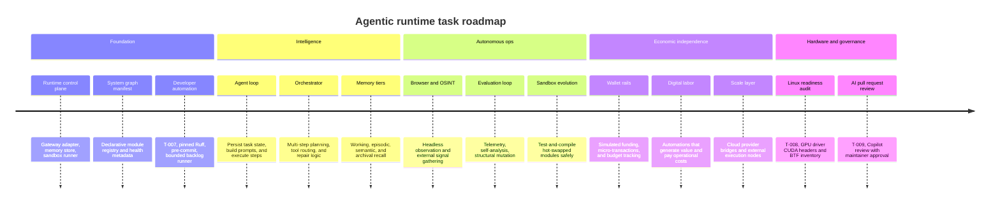

# Agentic OS Task Graph

## Dependency order

1. Runtime control plane
2. Agent loop + memory contracts
3. System graph + safe execution
4. Observation and tool adapters
5. Evolution loop and self-healing improvements
6. Economic rails and external scaling
